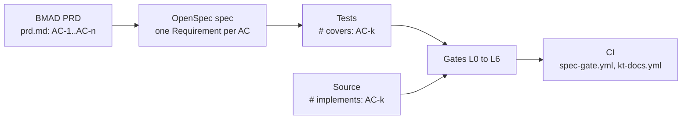

# specgate: knowledge transfer

## The problem

A green test suite proves the tests pass. It does not prove they test what the product owner asked for. Requirements live in one document, tests in another, and nothing forces them to stay in step.

specgate closes that gap. Every requirement is an acceptance criterion (AC) with an id such as `AC-3`. A feature cannot merge until each AC is specified, implemented, covered by a test, executed, and shown to catch bugs.

## The flow



| Gate | Question it answers | Deterministic |
|---|---|---|
| L0 schema | Is the PRD well formed against `schema/prd.schema.json`? | yes |
| L1 static | Does the code pass lint, types, dead-code and banned-token checks? | yes |
| L2 trace | Does every AC have an `implements` and a `covers` marker, with real asserts? | yes |
| L3 run | Do all the covering tests pass? | yes |
| L4 coverage | Do the AC's tests actually execute the AC's code? | yes |
| L5 mutation | If the AC's code is broken on purpose, does a test fail? | yes, fixed seed |
| L6 debate | Do adversarial judges find a real flaw in the spec? | no, but a veto only counts if a deterministic recheck confirms it |

Gates run in order and stop at the first red one. The exit code is `10 + layer number`, so exit 13 means L3 failed.

The marker convention is the glue:

```python
# implements: AC-1
def validate_email(email): ...

# covers: AC-1
def test_validate_email_rejects_garbage(): ...
```

## How to add a feature

The change directory is `openspec/changes/<feature>/`. Use `openspec/changes/specgate/` as a worked example.

1. Write `prd.md` with frontmatter listing `feature` and `acs`. Each AC has `id`, `given`, `when`, `then`, and `tests` (at least one).
2. Write `proposal.md`, `tasks.md`, and `specs/<feature>/spec.md`, with one `### Requirement:` and at least one `#### Scenario:` per AC.
3. Write the tests first. Mark each with `# covers: AC-k`.
4. Write the code. Mark it with `# implements: AC-k`.
5. Add or change a file under `docs/kt/<feature>/`. The `kt-docs` check fails the PR unless the diff has an added or changed (not deleted) file under `docs/kt/`.
6. Run the gates locally (next section) until they are green.

## Running it locally

Install once (not editable, the way a consumer installs it, and the way CI does):

```bash
uv venv --python 3.12 && uv pip install "plugins/specgate[dev]"
```

Check a change, with the venv active (`python -m specgate` works whether the
venv keeps executables in `bin/` or, on Windows, `Scripts/`):

```bash
python -m specgate check --change openspec/changes/specgate --layers L0-L5
```

A green run prints one line per layer saying what it looked at, for example
`L5 ok: 33/33 mutants killed`. A gate that prints nothing cannot be told apart
from one that checked nothing.

Run the unit tests of the plugin itself (CI runs these too, on Linux and Windows):

```bash
python -m unittest discover -s plugins/specgate/tests -t plugins/specgate
```

L6 (debate) is not enforced in CI. The `specgate` CLI does not run it (`--layers L6` exits 2 with "L6 is not run by the CLI; use run_debate()") and no debate cache is committed, so CI replays nothing. The debate code lives in `plugins/specgate/src/specgate/` and is exercised by the plugin's unit tests. CI shows "L6 debate: run locally, see docs/kt/specgate; not enforced in CI yet".

Calibration, run locally (`.specgate/evidence/T16/calibration.json`, not committed to CI): the panel caught 5/5 bad fixtures and the L6 panel blocked 0/4 good ones. Caveat: the same file records `good_wrongly_blocked: 4`, because an earlier layer (L1, rule SG101) flagged all four good fixtures. So only the L6 result is 0/4; the end-to-end result in that artifact is not.

lefthook (`lefthook.yml`) runs `python -m specgate`, so activate the venv before committing.

To run the same workflows CI runs, use `act`. See [tutorials/act/README.md](../../../tutorials/act/README.md) for the setup and the exact commands.

## Using specgate from another repo

1. Install it: `pip install "git+https://github.com/josephrobertlopez/harness-engineering-demo@<sha>#subdirectory=plugins/specgate"`, or keep a copy inside the repo.
2. A vendored copy carries specgate's own `# implements:` markers. Put an empty `.specgate-skip` file at its root, or those markers are read as your repo's ACs.
3. Run from the repo root with `--change openspec/changes/<name>`. The OpenSpec check runs only for a directory that is exactly `openspec/changes/<name>`.
4. Write tests as unittest `TestCase` methods. L3 discovers with unittest, and L4 and L5 run single test ids such as `test_x.TestY.test_z`.

What each rule found the first time it ran for real, so you know they bite:

| Rule | Meaning | Why it exists |
|---|---|---|
| SG206 | An AC has no `implements` and no `covers` marker | Before it, an AC nobody had started passed L2 |
| SG502 | The AC's tests fail in the L5 sandbox before any mutation | The old sandbox flattened every module into one folder; specgate's own tests could not run there, so every mutant counted as killed and L5 measured nothing |
| SG503 | An AC's code has nothing L5 can mutate | Otherwise `0/0 mutants killed` reads as a pass |
| SG102 | mypy failed, including a failure that names no file | mypy used to be run on the literal name `specgate`, answered "Cannot read file", and L1 stayed green |
| SG105 | markdownlint failed, including output that names no file | markdownlint-cli2 reports on stderr as `f.md:3:81 error MD013/line-length ...`; the parser read stdout in another format, so markdownlint never failed a file. MD013 is off in `.markdownlint-cli2.jsonc` because prose here is not hard-wrapped |

Known limits:

- **AC ids are global.** Two active changes, or the markers an archived change leaves behind, collide. Keep one active change per repo.
- **Only one AC per marker.** `# covers: AC-1, AC-2` reads only `AC-1`.
- **Small mutation set.** L5 applies one mutant per operator type, at the first eligible node, and does not follow calls out of the marked function.
- **Slow.** A real L5 run is slow (about nine minutes for specgate's own change); the old one took under two minutes because it measured nothing.

## Where things live

| Path | What |
|---|---|
| `plugins/specgate/src/specgate/` | one module per gate, plus `cli.py` and `trace.py` |
| `plugins/specgate/schema/prd.schema.json` | the PRD frontmatter schema |
| `openspec/changes/<feature>/` | PRD, proposal, spec, tasks |
| `.github/workflows/spec-gate.yml` | CI for L0 to L5 (L6 is a labelled no-op) |
| `.github/workflows/kt-docs.yml` | CI rule: every PR adds or changes a file under `docs/kt/` |
