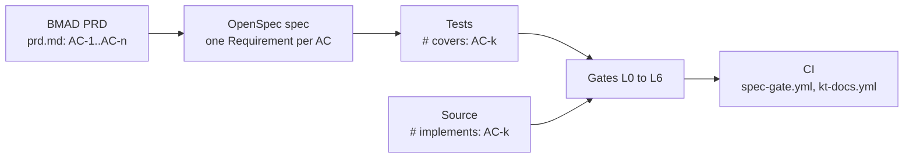

# specgate: knowledge transfer

## The problem

A green test suite proves the tests pass. It does not prove they test what the product owner asked for. Requirements live in one document, tests in another, and nothing forces them to stay in step.

specgate closes that gap. Every requirement is an acceptance criterion (AC) with an id such as `AC-3`. A feature cannot merge until each AC is specified, implemented, covered by a test, executed, and shown to catch bugs.

## The flow



| Gate | Question it answers | Deterministic |
|---|---|---|
| L0 schema | Is the PRD well formed against `schema/prd.schema.json`? | yes |
| L1 static | Does the code pass lint, types, dead-code and banned-token checks? | yes |
| L2 trace | Does every AC have an `implements` and a `covers` marker, with real asserts? | yes |
| L3 run | Do all the covering tests pass? | yes |
| L4 coverage | Do the AC's tests actually execute the AC's code? | yes |
| L5 mutation | If the AC's code is broken on purpose, does a test fail? | yes, fixed seed |
| L6 debate | Do adversarial judges find a real flaw in the spec? | no, but a veto only counts if a deterministic recheck confirms it |

Gates run in order and stop at the first red one. The exit code is `10 + layer number`, so exit 13 means L3 failed.

The marker convention is the glue:

```python
# implements: AC-1
def validate_email(email): ...

# covers: AC-1
def test_validate_email_rejects_garbage(): ...
```

## How to add a feature

The change directory is `openspec/changes/<feature>/`. Use `openspec/changes/specgate/` as a worked example.

1. Write `prd.md` with frontmatter listing `feature` and `acs`. Each AC has `id`, `given`, `when`, `then`, and `tests` (at least one).
2. Write `proposal.md`, `tasks.md`, and `specs/<feature>/spec.md`, with one `### Requirement:` and at least one `#### Scenario:` per AC.
3. Write the tests first. Mark each with `# covers: AC-k`.
4. Write the code. Mark it with `# implements: AC-k`.
5. Add or update a doc under `docs/kt/<feature>/`. CI fails the PR without one.
6. Run the gates locally (next section) until they are green.

## Running it locally

Install once:

```bash
uv venv --python 3.12 && uv pip install -e "plugins/specgate[dev]"
```

Check a change:

```bash
.venv/bin/specgate check --change specgate --layers L0-L5
npx -y @fission-ai/openspec@1.14.0 validate specgate --strict
```

Run the unit tests of the plugin itself:

```bash
cd plugins/specgate && ../../.venv/bin/python -m unittest discover -s tests -t .
```

L6 calls the `claude` CLI. It replays a committed cache, so it needs no token unless the spec changed.

To run the same workflows CI runs, use `act`. See [tutorials/act/README.md](../../../tutorials/act/README.md) for the setup and the exact commands.

## Where things live

| Path | What |
|---|---|
| `plugins/specgate/src/specgate/` | one module per gate, plus `cli.py` and `trace.py` |
| `plugins/specgate/schema/prd.schema.json` | the PRD frontmatter schema |
| `openspec/changes/<feature>/` | PRD, proposal, spec, tasks |
| `.github/workflows/spec-gate.yml` | CI for L0 to L6 |
| `.github/workflows/kt-docs.yml` | CI rule: every PR carries a KT doc |
